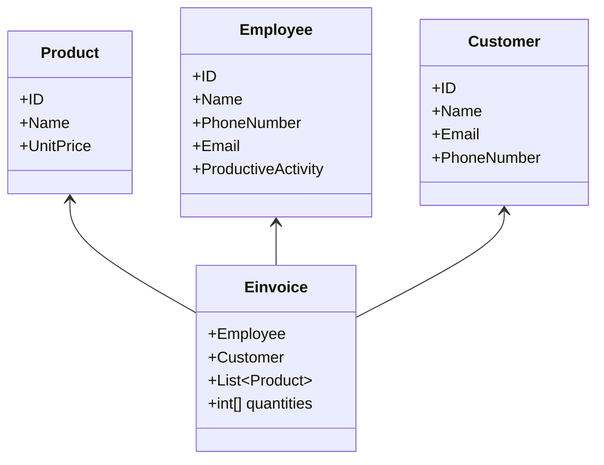
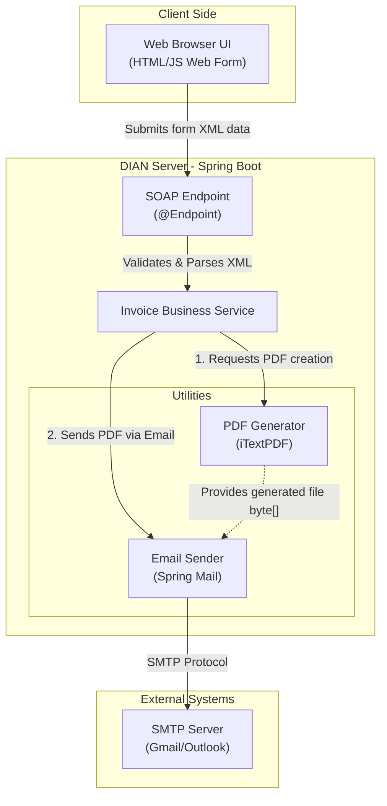
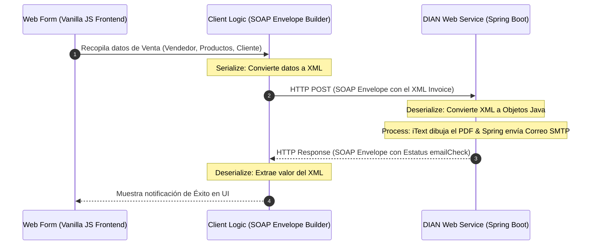

# Taller - Sistema de Facturación Electrónica (SOAP)

**Materia:** Electiva II  
**Integrantes:** 
- David Steven Sanchez
- Jose Luis Salamanca Lopez

---

## 1. Descripción del Taller

El taller consiste en un sistema de facturación electrónica simulando la arquitectura de integración de la **DIAN**. Cuenta con un backend robusto basado en servicios web clásicos (SOAP) y un frontend muy creativo que implementa la metáfora de escritorio a través de un sistema operativo ficticio y retro llamado **WinMac OS 1.0**.

---

## 2. Tecnologías Utilizadas

### Backend (Core)
- **Java 21 & Spring Boot 3.x:** Infraestructura principal del servidor.
- **Spring Web Services:** Para exponer los endpoints bajo el protocolo SOAP 1.1.
- **JAXB:** Para la serialización y deserialización automática de XML a Objetos Java, regidos por el archivo contrato `EinvoiceSystem.xsd`.
- **iTextPDF:** Librería de uso empresarial para dibujar y generar el archivo PDF en memoria RAM.
- **JavaMailSender:** Módulo de Spring conectado por protocolo SMTP (Gmail) para el despacho de correos electrónicos.

### Frontend (Non-Core)
- **Vanilla JavaScript, HTML5 y CSS3:** El frontend no utiliza frameworks pesados (como React o Angular). Toda la lógica del sistema de ventanas (WinMac OS) y el consumo del servicio SOAP mediante la construcción manual de *Envelopes XML* se realizó con la API `fetch` nativa del navegador.

---

## 3. Justificaciones Técnicas Arquitectónicas

Durante el diseño de la solución se tomaron las siguientes decisiones de ingeniería:

1. **Uso de Vanilla JavaScript:** Se optó por JS puro para demostrar dominio de los fundamentos web y manipulación directa del DOM. Además, al integrar servicios SOAP, era más eficiente manipular la creación de XML a bajo nivel sin que un framework intentara forzar la serialización JSON. Garantiza cero dependencias y carga inmediata.
2. **Arquitectura Stateless (Sin Base de Datos Relacional):** El servidor actúa como un **Middleware de Integración**. Su única responsabilidad es recibir un mensaje, procesar el PDF, despacharlo por correo y responder. La persistencia oficial de los datos recae sobre el correo electrónico enviado y sobre el ERP ficticio de la empresa.
3. **Interfaz de Escritorio (Desktop Metaphor):** Aumenta drásticamente la productividad del usuario mediante la multitarea, permitiendo tener catálogos y el formulario de facturación abiertos simultáneamente sin cambiar de pestañas.

---

## 4. Modelo de Clases y Lógica de Negocio (Dominio)

El siguiente diagrama muestra las entidades definidas estrictamente en el contrato `EinvoiceSystem.xsd`. La Factura (`Einvoice`) actúa como entidad agregadora de los demás elementos:

### Detalle de Entidades (Contrato XSD)

| Entidad | Descripción | Campos (Propiedades) |
| :--- | :--- | :--- |
| **Employee** | Representa al Vendedor o Emisor de la factura. | `ID`, `Name`, `phoneNumber`, `email`, `productiveActivity` |
| **Customer** | Representa al Cliente o Adquiriente. | `ID`, `Name`, `email`, `phoneNumber` |
| **Product** | Representa un artículo a la venta. | `ID`, `name`, `unitPrice` |
| **Einvoice** | Entidad principal (Factura) que agrupa los datos. | `Employee` (objeto), `Customer` (objeto), `Product` (lista), `quantities` (lista de enteros) |

### Operaciones (Endpoints SOAP)

| Request (Petición) | Response (Respuesta) | Descripción |
| :--- | :--- | :--- |
| `<EmployeeListRequest>` | `<EmployeeListResponse>` | Devuelve el catálogo completo de empleados. |
| `<CustomerListRequest>` | `<CustomerListResponse>` | Devuelve el catálogo completo de clientes. |
| `<ProductListRequest>` | `<ProductListResponse>` | Devuelve el catálogo completo de productos. |
| `<Einvoice>` | `<RegisterPurchaseResponse>` | Recibe la factura completa, genera el PDF, envía el correo y devuelve una bandera `emailCheck`. |

---

## 5. Arquitectura de Componentes del Sistema

Este diagrama detalla los bloques estructurales de la aplicación y la separación de responsabilidades:

---

## 6. Flujo de Comunicación Cliente-Servidor (Sequence Flow)

Este diagrama ilustra el viaje de la información, demostrando cómo el código Vanilla JS actúa como *Stub* para empaquetar la petición en el sobre de seguridad **SOAP Envelope**.

---

## 7. Conclusiones

*   **Integración Efectiva:** El taller demuestra con éxito cómo conectar tecnologías de servidor modernas (Java 21, Spring Boot) con protocolos empresariales estándar (SOAP), logrando una comunicación segura y estructurada mediante contratos XSD.
*   **Arquitectura Modular:** Al separar el sistema en componentes con responsabilidades únicas (Endpoints, Servicios de Negocio, Generación de PDF y Despacho de Correo), se obtuvo un código limpio, fácil de mantener y de escalar.
*   **Eficiencia en el Frontend:** La implementación de una interfaz multitarea creativa (WinMac OS) utilizando *Vanilla JavaScript* comprueba que es posible construir interfaces de usuario rápidas, ligeras y muy interactivas sin necesidad de depender de frameworks externos pesados.
