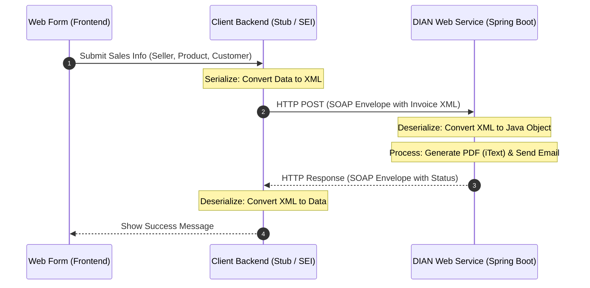

# DIAN Electronic Invoicing - SOAP Flow

This diagram illustrates the SOAP architecture applied specifically to the DIAN electronic invoicing project, showing how the web form data is processed, converted to XML, and handled by the Spring Boot server to generate a PDF and send an email.

## Sequence Diagram

## Concise Flow Description

1. **Submit Data**: The user fills out the Web Form with the sales information and sends it to their local system.
2. **Serialization (Stub)**: The client's Stub converts this data into a strict SOAP XML format, following the rules of the DIAN's WSDL.
3. **SOAP Request**: The XML is securely sent inside a SOAP Envelope to the DIAN Web Service (Spring Boot).
4. **Server Processing**: The DIAN server receives and reads the XML. It then executes the business logic: generating the invoice PDF with the DIAN logo (using iTextPDF) and sending the confirmation email.
5. **SOAP Response**: The DIAN server replies with a SOAP Envelope containing the operation's result (e.g., success and invoice number).
6. **Result**: The Stub translates the XML response back into readable data, and the Web Form displays the final confirmation to the user.
